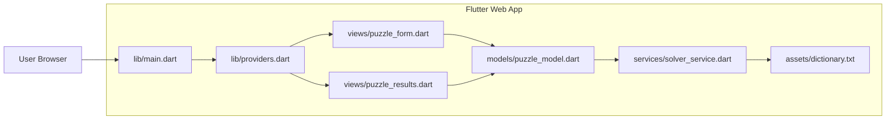
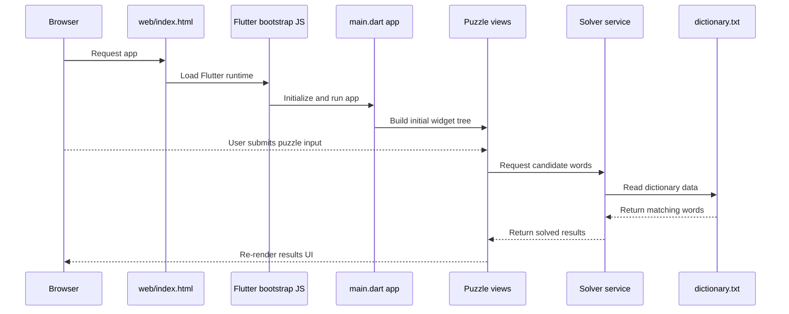
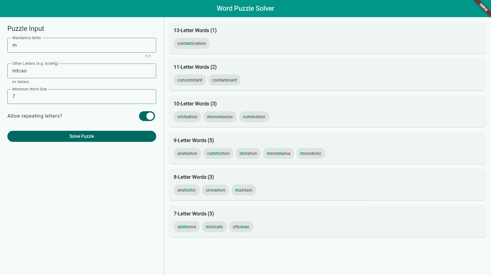

# Word Puzzle Solver

This repository contains a local word-puzzle solver deployed as a pure Flutter
Web app.

## Architecture Overview

### Component Diagram



### Web Rendering Flow



## Sample Puzzle

The puzzle consists of one mandatory letter, additional allowed letters, a
minimum word size, and an optional repeat-letters rule. The goal is to find all
valid words that satisfy these constraints.

- **Mandatory Letter**: `m` (must appear in every word)
- **Other Letters**: `itncao`
- **Minimum Word Size**: `4`
- **Allow Repeating Letters**: Yes
- **Dictionary**: A standard English dictionary is used to validate the words.



## Requirements and Change Notes

See project notes in [docs/](docs/)

- [Initial Application Requirements (historical, pre-refactor)](docs/app-requirements.md)
- [Application Deliverables](docs/app-deliverables.md)
- [Refactoring Requirements](docs/refactor-requirements.md)
- [Refactoring Implementation](docs/refactor-implementation-plan.md)
- [Changes](docs/changes.md)

## Quick Start

### Prerequisites

- Flutter SDK (stable channel)
- GNU Make
- (Optional) Docker and Docker Compose

  Note: some environments use the legacy `docker-compose` (hyphen) command.

### Install dependencies

From the repository root:

```bash
flutter pub get
```

To safely upgrade dependencies that are compatible with the current SDK and
constraints:

```bash
make deps-upgrade-safe
```

### Format

From the repository root:

```bash
make format
# or
dart format .
```

### Run via Docker Compose

To start the project locally with the bundled Nginx server:

```bash
# Docker Compose v2 (recommended)
docker compose up --build
```

The web UI will be served at `http://localhost:8080`.

#### Docker build tips

- To use prebuilt web assets (faster): first build assets locally, then build
  the image's `prebuilt` target:

```bash
make build
docker build --target prebuilt -t wordpuzzle .
docker run -p 8080:80 wordpuzzle
```

- Default image build runs the Flutter build inside the image (slower):

```bash
docker build -t wordpuzzle .
docker run -p 8080:80 wordpuzzle
```

### Run the Flutter app locally

From the repository root:

```bash
make run
```

Note: Type `q` to quit the session.

This defaults to running the Flutter app in Chrome.

This project targets the web only.

## Build

From the repository root:

```bash
make build
```

This compiles a JavaScript web build into `build/web`.

The build target uses `--base-href /flutter-wordpuzzle/` by default. Override
with:

```bash
make build WEB_BASE_HREF=/
```

## Tests

To run the Flutter tests:

```bash
make test
```

## Updates

To check for outdated packages:

```bash
flutter pub outdated
```

To update packages to the latest versions allowed by the current constraints:

```bash
make deps-upgrade-safe
# or
flutter pub upgrade
```

To update all packages to their newest major versions (this updates
`pubspec.yaml`):

```bash
flutter pub upgrade --major-versions
```

## CI and Deployment

- CI runs format checks, analysis, standard JS tests, JS web build.
- GitHub Pages deployment (on `main`) publishes a **JS release** build.

## Legacy Code

The original TypeScript and React Node frontend codes have been completely
removed from the active app stack. The current implementation is a pure Flutter
Web client with a client-side Dart solver and Riverpod-managed state.
